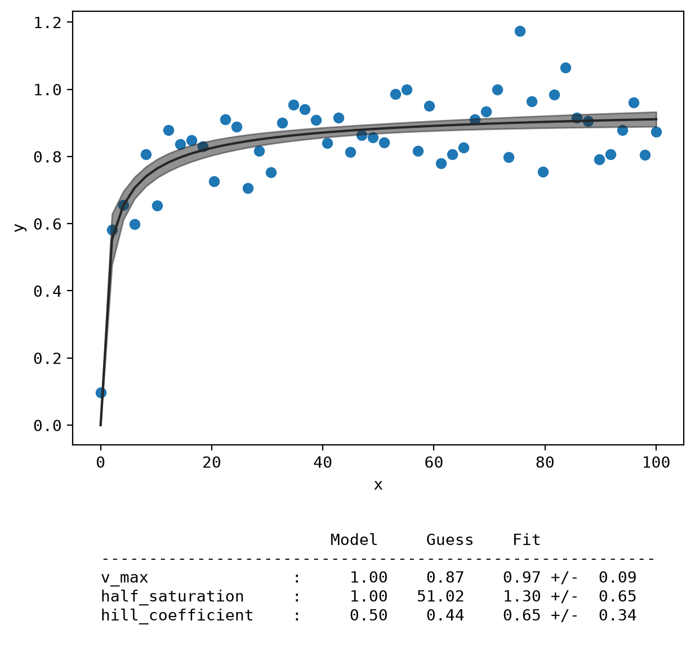
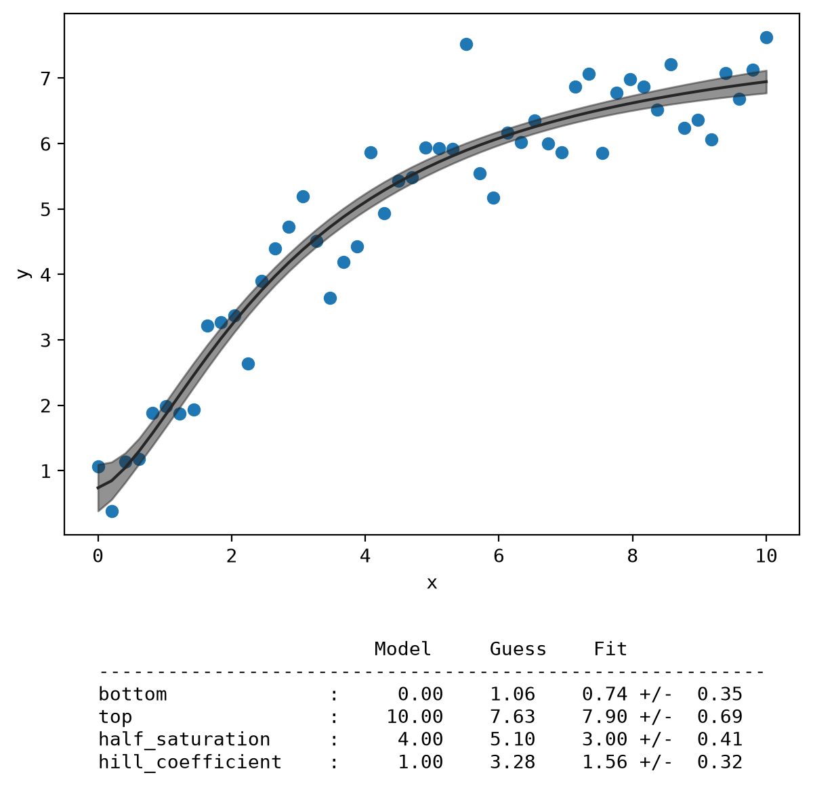
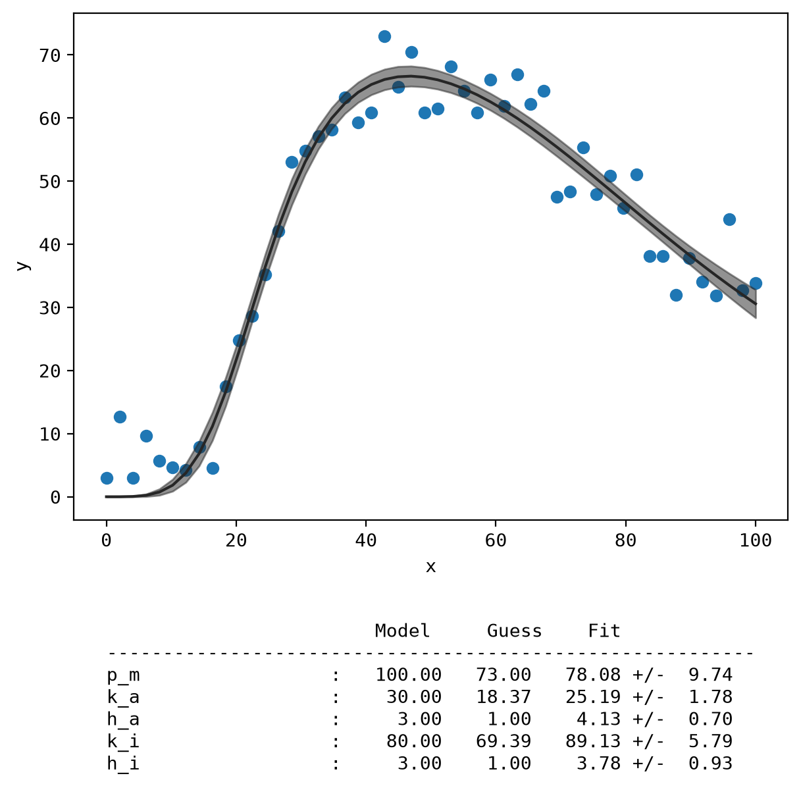

# Binding plot

[Add some plots to this page for examples]: # 

## Hill equation

The Hill equation is defined as:

$y = V_{max} * \frac{x^n }{K_{half}^n + x^n}$

## Modified Hill equation

The Modified Hill equation adds an additional variable to potentially better fit the initial and final plateaus of the data:

$y = bottom + (top - bottom) * \frac{x^n }{K_{half}^n + x^n}$

## BiHill equation
The BiHill equation is defined as:

$y = \frac{p_m}{\left[ 1 + \left( \frac{k_a}{x} \right )^{h_a} \right]\left[ 1 + \left( \frac{x}{k_i} \right )^{h_i} \right]}$

