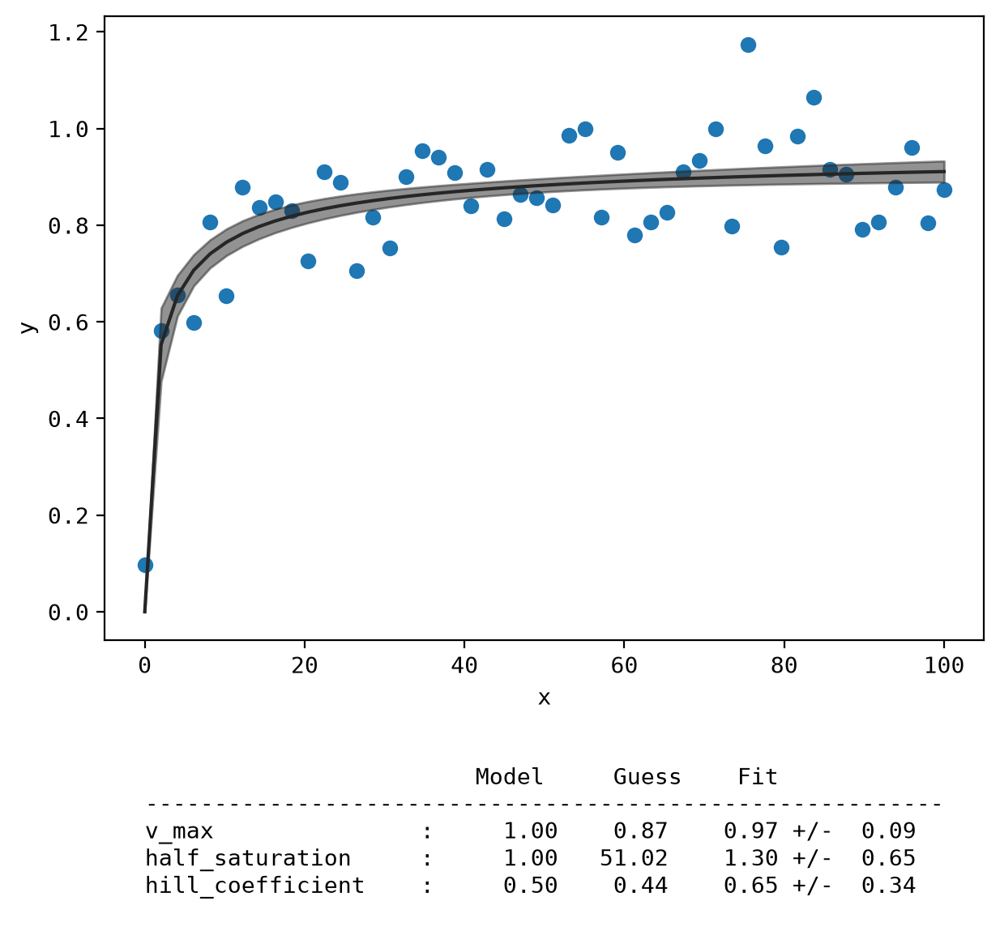
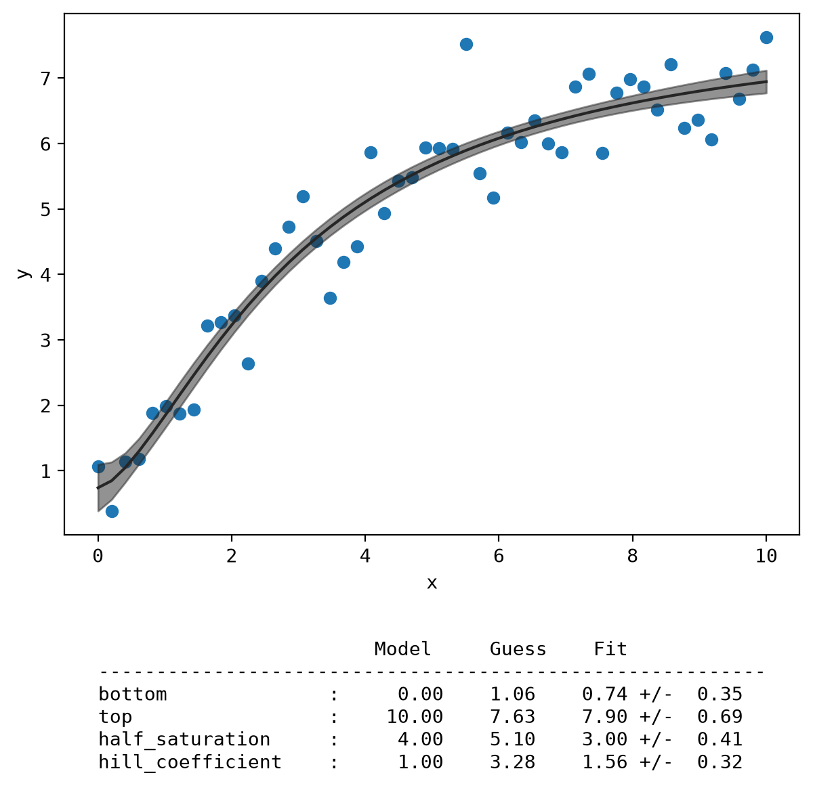
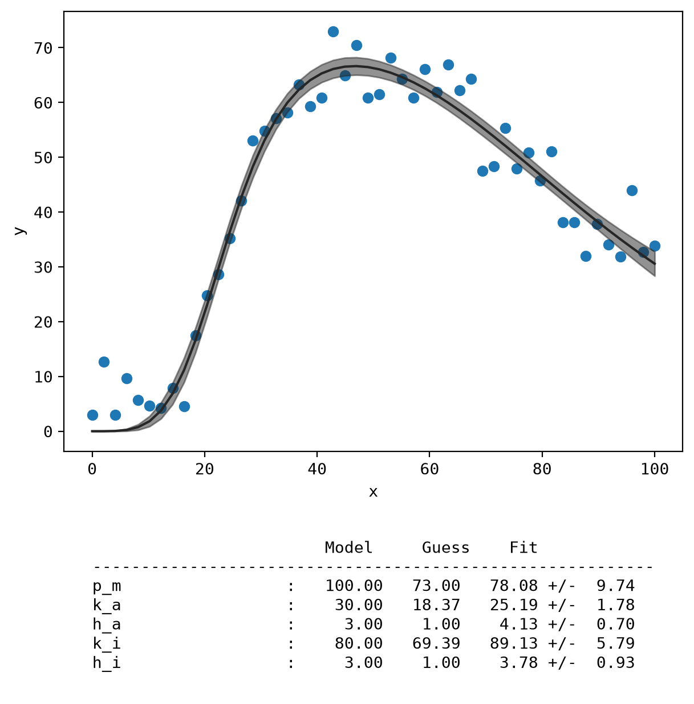

# Binding Plot

Plots the output of the [Binding Data](binding_data.md) widget and fits it with a Hill-type equation.

## Controls

- **X variable** / **Y variable**: the columns to plot. They default to `Titration point` and `Delta A`.
- **Point size** and **Fit line width**: appearance of the plot.
- **Select fit model**: one of the equations below.
- **Fit model** runs the fit with lmfit and draws the curve; **Clear fit** removes it.

## Output

**Hill Fit Results**: one row per fitted parameter (plus `r_sq` and `red_chi_sq`) with its `Estimate`, `Standard Error` and `Unit`.

The fitting needs at least four finite points with distinct, non-negative x values.

## Hill model (3 variable)

The Hill equation is defined as:

$y = V_{max} * \frac{x^n }{K_{half}^n + x^n}$

## Hill model (4 variable)

The Modified Hill equation adds an additional variable to potentially better fit the initial and final plateaus of the data:

$y = bottom + (top - bottom) * \frac{x^n }{K_{half}^n + x^n}$

## BiHill model

The BiHill equation is defined as:

$y = \frac{p_m}{\left[ 1 + \left( \frac{k_a}{x} \right )^{h_a} \right]\left[ 1 + \left( \frac{x}{k_i} \right )^{h_i} \right]}$

