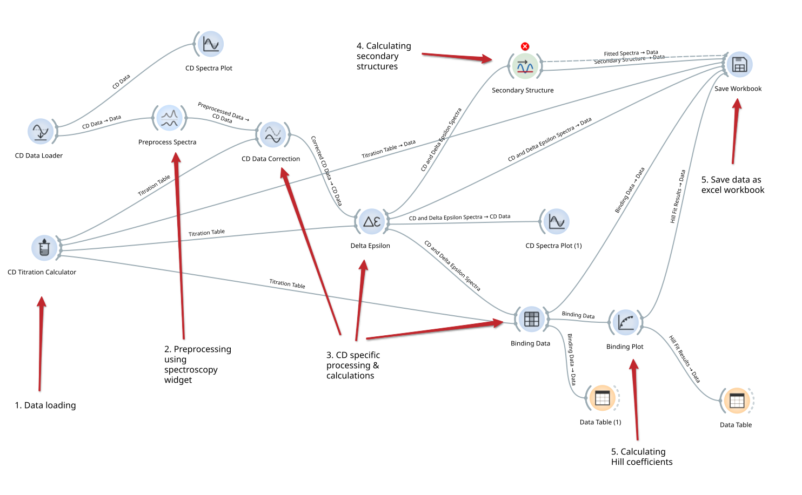

# Example pipeline

The above figure shows an example pipeline of how data may be analysed. Here we run through the steps in sequence.

## 1. Load data, input relevant information

The first step is to load experimental data using the [Titration calculator](titration_calculator.md) and the [CD data loader](cd_data_loader.md) widgets. 

The data loader is currently limited to reading only `.csv` files. As described in the widget documentation page, it has fields for background data, as well as titration points.

The titration calculator widget contains fields for all inputs required for calculations across the experiment.

## 2. Preprocess the data

Experimental data is read by the data loader widget to the same structure as data is stored in the orange-spectroscopy package. The widgets in this package are therefore interoperable with CD data. Usefully, this means that the spectroscopy preprocessing widget can be used for cutting and baseline subtracting spectra. More detailed information for that widget is on the [documentation page](https://orange-spectroscopy.readthedocs.io/en/latest/widgets/preprocess-spectra.html). There is an example there of using the two most relevant features: `cut`, and `baseline correction`. 

The `cut` method can remove a section of spectrum that is not required for analysis. THe `baseline correction` works as described to correct the spectrum to a zero point. For CD data, the "Linear" method for baseline type is most appropriate.

## 3. Processing & calculations

The core processing and calculation of the titration processing pipeline occurs is performed with the [CD Data Correction](cd_data_correction.md), [Delta Epsilon](delta_epsilon.md), and [Binding data](binding_data.md) widgets. 

The data correction will work without any user interaction if it uses the preprocessing widget as an input. In short, the widget performs concentration-dependent titration corrections to each spectrum in turn, using the titration table as a second source of input information.

The Delta Epsilon widget calculates the delta epsilon spectra. The series selection by default should be correct (Titration data series = "plus_sol_A", Solution A series = "sol_A_buffer_subtracted"). As the widget documentation describes, some more information may be necessary to input at this stage for your calculation.

The Binding data widget is used to simply select the wavelength at which to calculate ligand binding. The vertical line on the plot in the widget can be dragged & dropped to the desired location. The spectra shown by default are the delta epsilon spectra output by the previous widget in the pipeline.

## 4. Secondary structure calculation

> [!NOTE]
> This widget is under active development and has not been tested extensively.

The [secondary structure widget](secondary_structure.md) will calculate secondary structure propensities for each spectra in the delta epsilon set. The raw spectra and the fitted one, along with various fitting statistics, are output into a data table that can be read by spreadsheet software.

## 5. Calculating Hill coefficients etc.

The [Binding plot](binding_plot.md) widget is used to fit the binding data according to a user selected model. The output can be sent to a data table for direct reading, including optimised fit parameters and fitting statistics. The widget shows the plot and a 1σ uncertainty.

## 6. Data output

Any number of data tables generated during the pipeline can be passed as inputs to the [Save Workbook](save_workbook.md) widget. The widget compiles all the tables it is given, and can save them as a single (.xlsx) workbook. The exact names of the output sheets can be customised in the widget.
